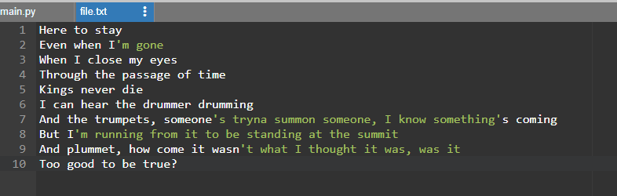
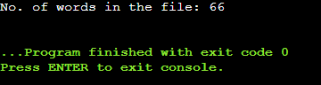

# Word-count
## AIM:
To write a python program for getting the word count from a text.
## EQUIPEMENT'S REQUIRED: 
PC
Anaconda - Python 3.7
## ALGORITHM: 
### Step 1:
Use open function to open the file in which we want to know the number of words
### Step 2: 
Use read access mode
### Step 3: 
Use split() function inside the loop
### Step 4:  
Iterate the each value and increment it by 1
### Step 5: 
Print outside the for loop
### Step 6: 
The END.
## PROGRAM:
```
#Program to count the number of words in a file
#Developed by: Pradeesh S
#Register number: 212221240038
with open("lose.txt","r") as fp:
    count=0
    for data in fp:
        l=data.split()
        for i in l:
            count+=1 
    print("No. of words in the file:",count)
```
### FILE:

### OUTPUT:


## RESULT:
Thus the program is written to find the word count from a text.
